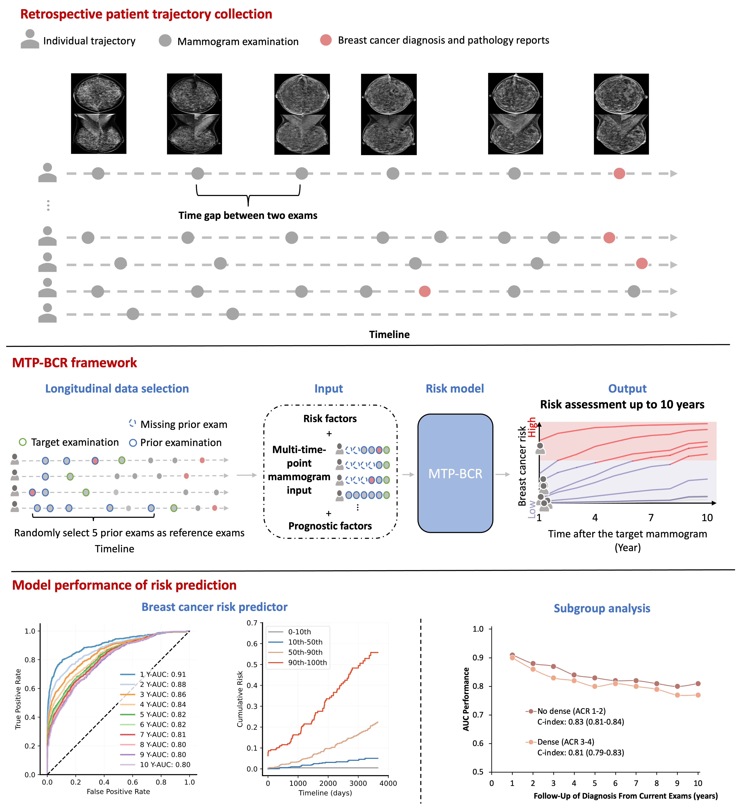
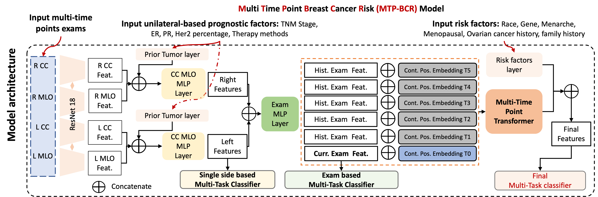

# MTP-BCR: Predicting long term breast cancer risk using longitudinal mammographic screening history

Risk assessment of breast cancer (BC) seeks to enhance individualized screening and prevention strategies.
Recent deep learning (DL) risk models based on mammography have shown
superiority in short-term risk prediction compared to traditional risk factor-based models.
However, those models primarily rely on single-time exams and thus ignore the temporal changes
in breast tissues that can be extracted from sequence exams.
Here, we present the **Multi-Time Point Breast Cancer Risk Model (MTP-BCR)**,
a novel temporospatial DL risk model that integrates traditional BC risk factors
and longitudinal mammography data to identify subtle changes in breast
tissue indicative of future malignancy. Utilizing a large inhouse dataset
comprising risk factors and 171,168 mammograms involving 9,133 women,
we evaluate the performance of the MTP-BCR model in long-term risk prediction.
Our model demonstrates a significant improvement in 10-year risk prediction
with an area under the receiver operating characteristics (AUC) of 0.80,
outperforming the traditional BCSC 10-year risk model,
our pure image model (without risk factors), and is also superior to
other SOTA methods at 5-year AUC in various screening cohorts.
Furthermore, MTP-BCR provides unilateral breast-level predictions with
AUCs up to 0.81 and 0.77 for 5-year and 10-year risk assessments, respectively.
The validation on the public CSAW-CC dataset demonstrates the consistent
advantage of our multi-time point-based model compared to the single-time
point-based method. For the prediction of breast cancer recurrence,
our MTP-BCR obtains a 5-year AUC of 0.71 which also surpasses other methods.
The heatmaps derived from our model may help clinicians better understand the
progression from normal tissue to cancerous growth, enhancing interpretability
in breast cancer risk assessment.

## Overview of study


## Model architecture


## Usage

### Requirements:

* pytorch
* numpy
* pandas
* scikit-learn
* ...

### Environment
```bash
conda env create -f py37_environment.yml  # don't forget to change the path
conda activate py37
```


### Example training:
```bash
python src/train.py \
  --method side_specific_4views_mtp_tumor \
  --num-classes 16 \   #   leveraged the 15 years follow-up to train the risk model
  --test-num-classes 11 \  #  test the model's performance of 10-year risk prediction
  --batch-size 8 \
  --num_time_points 6 \  # input 6 time point exams, for one current exams and five history exams
  --use_risk_factors \
  --multi_tasks \
  --pooling last_timestep \
  --years_at_least_followup 0 \
  --results-dir ./log/Mammo_risk/
```

The configs above are meant to specify exact implementation details and our experimental procedure


### Predicting on External Dataset
```bash
python custom_predict.py \
    --path_risk_model $dir_pretrained_weigths \
    --test_results_dir $dir_results
```


## Disclaimer
This code and accompanying pretrained models are provided with no guarantees
regarding their reliability, accuracy or suitability for any particular
application and should be used for research purposes only. The models and code
are not to be used for public health decisions or responses, or for any
clinical application or as a substitute for medical advice or guidance.


## Citation
If you use this code or models in your scientific work, please cite the following paper:
```bibtex
@article{wang2023predicting,
  title={Predicting up to 10 year breast cancer risk using longitudinal mammographic screening history},
  author={Wang, Xin and Tan, Tao and Gao, Yuan and Su, Ruisheng and Zhang, Tianyu and Han, Luyi and Teuwen, Jonas and D'Angelo, Anna and Drukker, Caroline A and Schmidt, Marjanka K and others},
  journal={medRxiv},
  pages={2023--06},
  year={2023},
  publisher={Cold Spring Harbor Laboratory Press}
}
```

## License

The code is MIT licensed, as found in the [LICENSE file](LICENSE)

## Contact details
If you have any questions please contact us.

Email: ritse.mann@radboudumc.nl (Ritse Mann); taotanjs@gmail.com (Tao Tan); x.wang@nki.nl (Xin Wang)

Links: [Netherlands Cancer Institute](https://www.nki.nl/),
[Radboud University Medical Center](https://www.radboudumc.nl/en/patient-care) and
[Maastricht University](https://www.maastrichtuniversity.nl/nl)

## Acknowledgements:
